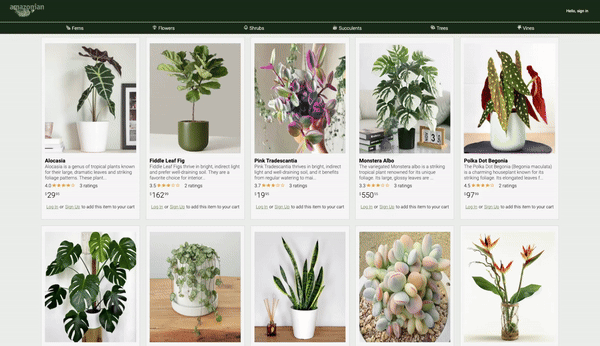
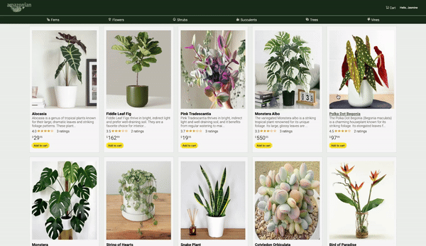
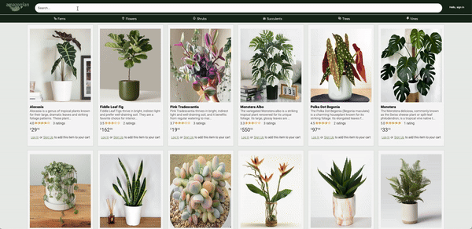

# amazonian
Amazonian is inspired by the popular e-commerce platform 'Amazon', that features some of my favorite plants! This site mimics Amazon's layout, functionality, aethestics, and intuitive navigation. Amazonian features 3 full CRUD functionalities for managing products, reviews, and shopping carts. Amazonian also features OAuth which streamlines signup and login process for user convenience and security. Join Amazonian today to feature your favorite plant or to explore our products!

## Live Site
- https://amazonian-blt9.onrender.com/

### Landing Page and login

### Review

### Shopping Cart

### Product

### Search

## Clone This Project
1. Clone this repository
2. Install your dependencies
    - In root run: `pipenv install -r requirements.txt`
    - In react-vite run: `npm install`
3. Create .env file and include
    - SECRET_KEY
    - DATABASE_URL
    - FLASK_ENV
    - SCHEMA
    - S3_BUCKET
    - S3_KEY
    - S3_SECRET
    - GOOGLE_OAUTH_CLIENT_ID
    - GOOGLE_OAUTH_CLIENT_SECRET
4. Create your local database
    - Enter your virtual environment
        - In root run: `pipenv shell`
    - Create database
        - In virtual environment run: `flask db init`
        - In virtual environment run: `flask db migrate`
        - In virtual environment run: `flask db upgrade`
    - Seed Data
        - In virtual environment run: `flask seed all`
5. Run Local Servers
    - Enter virtual shell
        - In virtual environment run: `flask run`
    - In react-vite run: `npm run dev`

## Featured Technology
### Frameworks and Libraries

### Database

### Hosting

## Database Schema

## Feature List
1. Reviews
    - View all reviews on a product
    - Create a new review on a product
    - Update user's exisiting review
    - Delete user's exisiting review
2. Cart
    - View all products in cart
    - Add new product into cart
    - Update product quantity in cart
    - Delete product from cart
3. Products
    - View all products
    - Create a new product
    - Update user's exisiting product
    - Delete user's exisiting product
4. Search/Sort Filter
    - User will be able to search for product by category or name

## Future Features
5. Order History
    - Users will be able to view their order history if a cart has been checkout

## Endpoints
### Auth
| Request   | Purpose      | Return Value |
| --------- | ------------ | ------------ |
| GET /api/auth | If a user is logged in, will fetch user's details | { &nbsp;&nbsp;"createdAt": "Thu, 25 Apr 2024", &nbsp;&nbsp;"email": "guest@email.com", &nbsp;&nbsp;"first_name": "Jasmine's Guest", &nbsp;&nbsp;"id": 1, &nbsp;&nbsp;"last_name": "User", &nbsp;&nbsp;"updatedAt": "Thu, 25 Apr 2024", &nbsp;&nbsp;"username": "Guest" } Status Code: 200 |
| POST /api/auth/signup | Creates a new user and logs user in | { &nbsp;&nbsp;"createdAt": "Fri, 26 Apr 2024", &nbsp;&nbsp;"email": "test@test.com", &nbsp;&nbsp;"first_name": "test", &nbsp;&nbsp;"id": 12, &nbsp;&nbsp;"last_name": "test", &nbsp;&nbsp;"updatedAt": "Fri, 26 Apr 2024", &nbsp;&nbsp;"username": "Test" } Status Code: 200 |
| POST /api/auth/login | Logs in a current user with valid credentials and returns the current user's information.  | { &nbsp;&nbsp;"createdAt": "Thu, 25 Apr 2024", &nbsp;&nbsp;"email": "demo@aa.io", &nbsp;&nbsp;"first_name": "Demo", &nbsp;&nbsp;"id": 2, &nbsp;&nbsp;"last_name": "Lition", &nbsp;&nbsp;"updatedAt": "Thu, 25 Apr 2024", &nbsp;&nbsp;"username": "Demo" } Status Code: 200|
| POST /api/auth/logout | Logs out the current user and return a message if successful | { &nbsp;&nbsp;"message": "User logged out" } Status Code: 200|

### Reviews
| Request   | Purpose      | Return Value |
| --------- | ------------ | ------------ |
| GET /api/products/:productId/reviews  | Gets all the reviews by Product's id| { &nbsp;&nbsp;"Reviews" : [ &nbsp;&nbsp;&nbsp;&nbsp;{ &nbsp;&nbsp;&nbsp;&nbsp;&nbsp;&nbsp;"createdAt": "Thu, 25 Apr 2024", &nbsp;&nbsp;&nbsp;&nbsp;&nbsp;&nbsp;"id": 1, &nbsp;&nbsp;&nbsp;&nbsp;&nbsp;&nbsp;"image_url": "https://amazonian/example.png", &nbsp;&nbsp;&nbsp;&nbsp;&nbsp;&nbsp;"product_id": 1, &nbsp;&nbsp;&nbsp;&nbsp;&nbsp;&nbsp;"rating": 5, &nbsp;&nbsp;&nbsp;&nbsp;&nbsp;&nbsp;"review": "Beautiful plant!", &nbsp;&nbsp;&nbsp;&nbsp;&nbsp;&nbsp;"updatedAt": "Thu, 25 Apr 2024", &nbsp;&nbsp;&nbsp;&nbsp;&nbsp;&nbsp;"user_id": 10 &nbsp;&nbsp;&nbsp;&nbsp;&nbsp;&nbsp;} &nbsp;&nbsp;&nbsp;&nbsp;] &nbsp;&nbsp;}  Status Code: 200|
| GET /api/reviews/current | Gets all current user's reviews  | { &nbsp;&nbsp;"UserReviews": [ &nbsp;&nbsp;&nbsp;&nbsp;{ &nbsp;&nbsp;&nbsp;&nbsp;&nbsp;&nbsp;"createdAt": "Thu, 25 Apr 2024", &nbsp;&nbsp;&nbsp;&nbsp;&nbsp;&nbsp;"id": 17, &nbsp;&nbsp;&nbsp;&nbsp;&nbsp;&nbsp;"image_url": "https://amazonian.ex.review.png", &nbsp;&nbsp;&nbsp;&nbsp;&nbsp;&nbsp;"product_id": 9, &nbsp;&nbsp;&nbsp;&nbsp;&nbsp;&nbsp;"rating": 5, &nbsp;&nbsp;&nbsp;&nbsp;&nbsp;&nbsp;"review": "Very happy with my purchase!", &nbsp;&nbsp;&nbsp;&nbsp;&nbsp;&nbsp;"updatedAt": "Thu, 25 Apr 2024", &nbsp;&nbsp;&nbsp;&nbsp;&nbsp;&nbsp;"user_id": 1 &nbsp;&nbsp;&nbsp;&nbsp;&nbsp;&nbsp;} &nbsp;&nbsp;&nbsp;&nbsp;] &nbsp;&nbsp;}  Status Code: 200|
| POST /api/products/:productId/reviews/new | Create a review for a product based on product's id| { &nbsp;&nbsp;"createdAt": "Fri, 26 Apr 2024", &nbsp;&nbsp;"id": 35, &nbsp;&nbsp;"image_url": "http://amazonian.test.png", &nbsp;&nbsp;"product_id": 20, &nbsp;&nbsp;"rating": 3, &nbsp;&nbsp;"review": "New review!", &nbsp;&nbsp;"updatedAt": "Fri, 26 Apr 2024", &nbsp;&nbsp;"user_id": 12 } Status Code: 200 |
| PUT /api/reviews/:reviewId/edit | Edit a review based on review's id | { &nbsp;&nbsp;"message": "Review updated successfully." } Status Code: 200 |
| DELETE /api/reviews/:reviewId/delete | Delete a review based on review's id | { &nbsp;&nbsp;"message": "Review successfully deleted." } Status Code: 200|

### Shopping Cart
| Request   | Purpose      | Return Value |
| --------- | ------------ | ------------ |
| GET /api/carts/all | Get all current user's carts | { &nbsp;&nbsp;"Carts": [ &nbsp;&nbsp;&nbsp;&nbsp;{ &nbsp;&nbsp;&nbsp;&nbsp;&nbsp;&nbsp;"cart_items": [ &nbsp;&nbsp;&nbsp;&nbsp;&nbsp;&nbsp;&nbsp;&nbsp;{ &nbsp;&nbsp;&nbsp;&nbsp;&nbsp;&nbsp;&nbsp;&nbsp;&nbsp;&nbsp;"cart_id": 2, &nbsp;&nbsp;&nbsp;&nbsp;&nbsp;&nbsp;&nbsp;&nbsp;&nbsp;&nbsp;"createdAt": "Thu, 25 Apr 2024", &nbsp;&nbsp;&nbsp;&nbsp;&nbsp;&nbsp;&nbsp;&nbsp;&nbsp;&nbsp;"id": 1, &nbsp;&nbsp;&nbsp;&nbsp;&nbsp;&nbsp;&nbsp;&nbsp;&nbsp;&nbsp;"product_id": 3, &nbsp;&nbsp;&nbsp;&nbsp;&nbsp;&nbsp;&nbsp;&nbsp;&nbsp;&nbsp;"quantity": 3, &nbsp;&nbsp;&nbsp;&nbsp;&nbsp;&nbsp;&nbsp;&nbsp;&nbsp;&nbsp;"updatedAt": "Thu, 25 Apr 2024" &nbsp;&nbsp;&nbsp;&nbsp;&nbsp;&nbsp;&nbsp;&nbsp;} &nbsp;&nbsp;&nbsp;&nbsp;&nbsp;&nbsp;] &nbsp;&nbsp;&nbsp;&nbsp;} &nbsp;&nbsp;] } Status Code: 200 |
| GET /api/carts/active | Get current user's active cart that has not been checked out yet | { &nbsp;&nbsp;"ActiveCart": { &nbsp;&nbsp;&nbsp;&nbsp;"cart_items": [], &nbsp;&nbsp;&nbsp;&nbsp;"createdAt": "Thu, 25 Apr 2024", &nbsp;&nbsp;&nbsp;&nbsp;"id": 1, &nbsp;&nbsp;&nbsp;&nbsp;"is_ordered": false, &nbsp;&nbsp;&nbsp;&nbsp;"updatedAt": "Thu, 25 Apr 2024", &nbsp;&nbsp;&nbsp;&nbsp;"user_id": 1 &nbsp;&nbsp;} } Status Code: 200 |
| POST /api/carts/new | Create a new cart that has not been checked out | { &nbsp;&nbsp;&nbsp;"cart_items": [], &nbsp;&nbsp;&nbsp;"createdAt": "Fri, 26 Apr 2024", &nbsp;&nbsp;&nbsp;"id": 5, &nbsp;&nbsp;&nbsp;"is_ordered": false, &nbsp;&nbsp;&nbsp;"updatedAt": "Fri, 26 Apr 2024", &nbsp;&nbsp;&nbsp;"user_id": 12 } Status Code: 200 |

### Shopping Cart Items
| Request   | Purpose      | Return Value |
| --------- | ------------ | ------------ |
| GET /api/carts/:cartId | Get all cart products based on the cart's id | { &nbsp;&nbsp;"CartItems": [ &nbsp;&nbsp;&nbsp;&nbsp;{ &nbsp;&nbsp;&nbsp;&nbsp;&nbsp;&nbsp;"cart_id": 5, &nbsp;&nbsp;&nbsp;&nbsp;&nbsp;&nbsp;"createdAt": "Fri, 26 Apr 2024", &nbsp;&nbsp;&nbsp;&nbsp;&nbsp;&nbsp;"id": 7, &nbsp;&nbsp;&nbsp;&nbsp;&nbsp;&nbsp;"product_id": 2, &nbsp;&nbsp;&nbsp;&nbsp;&nbsp;&nbsp;"quantity": 1, &nbsp;&nbsp;&nbsp;&nbsp;&nbsp;&nbsp;"updatedAt": "Fri, 26 Apr 2024" &nbsp;&nbsp;&nbsp;&nbsp;} &nbsp;&nbsp;] } Status Code: 200 |
| POST /api/carts:cartId/products/new| Add a new product into your cart based on cart's id | { &nbsp;&nbsp;"cart_id": 5, &nbsp;&nbsp;"createdAt": "Fri, 26 Apr 2024", &nbsp;&nbsp;"id": 7, &nbsp;&nbsp;"product_id": 2, &nbsp;&nbsp;"quantity": 1, &nbsp;&nbsp;"updatedAt": "Fri, 26 Apr 2024" } Status Code: 200 |
| PUT /api/carts/active/:cartItemId/ edit | Update product quantity based on cart item's id | { &nbsp;&nbsp;"message": "Cart Item quantity sucessfully updated." } Status Code: 200|
| DELETE /api/carts/active/:cartItemId/delete| Delete product in cart based on cart item's id | { &nbsp;&nbsp;"message": "Cart item successfully deleted." } Status Code: 200|

### Products
| Request   | Purpose      | Return Value |
| --------- | ------------ | ------------ |
| GET /api/products| Get all products | { &nbsp;&nbsp;"Products": [ &nbsp;&nbsp;&nbsp;&nbsp;{ &nbsp;&nbsp;&nbsp;&nbsp;&nbsp;&nbsp;"category": "Shrub", &nbsp;&nbsp;&nbsp;&nbsp;&nbsp;&nbsp;"createdAt": "Thu, 25 Apr 2024", &nbsp;&nbsp;&nbsp;&nbsp;&nbsp;&nbsp;"description": "Example description", &nbsp;&nbsp;&nbsp;&nbsp;&nbsp;&nbsp;"id": 1, &nbsp;&nbsp;&nbsp;&nbsp;&nbsp;&nbsp;"image_url": "https://amazonian.example.png", &nbsp;&nbsp;&nbsp;&nbsp;&nbsp;&nbsp;"name": "Plant", &nbsp;&nbsp;&nbsp;&nbsp;&nbsp;&nbsp;"price": "49.95", &nbsp;&nbsp;&nbsp;&nbsp;&nbsp;&nbsp;"reviews": [ &nbsp;&nbsp;&nbsp;&nbsp;&nbsp;&nbsp;&nbsp;&nbsp;{ &nbsp;&nbsp;&nbsp;&nbsp;&nbsp;&nbsp;&nbsp;&nbsp;&nbsp;&nbsp;"createdAt": "Thu, 25 Apr 2024", &nbsp;&nbsp;&nbsp;&nbsp;&nbsp;&nbsp;&nbsp;&nbsp;&nbsp;&nbsp;"id": 1, &nbsp;&nbsp;&nbsp;&nbsp;&nbsp;&nbsp;&nbsp;&nbsp;&nbsp;&nbsp;"image_url": "https://amazonian.review.png", &nbsp;&nbsp;&nbsp;&nbsp;&nbsp;&nbsp;&nbsp;&nbsp;&nbsp;&nbsp;"product_id": 1, &nbsp;&nbsp;&nbsp;&nbsp;&nbsp;&nbsp;&nbsp;&nbsp;&nbsp;&nbsp;"rating": 5, &nbsp;&nbsp;&nbsp;&nbsp;&nbsp;&nbsp;&nbsp;&nbsp;&nbsp;&nbsp;"review": "Such a cool plant!", &nbsp;&nbsp;&nbsp;&nbsp;&nbsp;&nbsp;&nbsp;&nbsp;&nbsp;&nbsp;"updatedAt": "Thu, 25 Apr 2024", &nbsp;&nbsp;&nbsp;&nbsp;&nbsp;&nbsp;&nbsp;&nbsp;&nbsp;&nbsp;"user_id": 6 &nbsp;&nbsp;&nbsp;&nbsp;&nbsp;&nbsp;&nbsp;&nbsp;} &nbsp;&nbsp;&nbsp;&nbsp;&nbsp;&nbsp;], &nbsp;&nbsp;&nbsp;&nbsp;&nbsp;&nbsp;"updatedAt": "Thu, 25 Apr 2024", &nbsp;&nbsp;&nbsp;&nbsp;&nbsp;&nbsp;"user_id": 1 &nbsp;&nbsp;&nbsp;&nbsp;} &nbsp;&nbsp;] } Status Code: 200 |
| GET /api/products/:productId| Get a specific product by product's id | { &nbsp;&nbsp;"category": "Vine", &nbsp;&nbsp;"createdAt": "Thu, 25 Apr 2024", &nbsp;&nbsp;"description": "Example description", &nbsp;&nbsp;"id": 7, &nbsp;&nbsp;"image_url": "https://amazonian.example.png", &nbsp;&nbsp;"name": "Plant", &nbsp;&nbsp;"price": "26.99", &nbsp;&nbsp;"reviews": [ &nbsp;&nbsp;&nbsp;&nbsp;{ &nbsp;&nbsp;&nbsp;&nbsp;&nbsp;&nbsp;"createdAt": "Thu, 25 Apr 2024", &nbsp;&nbsp;&nbsp;&nbsp;&nbsp;&nbsp;"id": 15, &nbsp;&nbsp;&nbsp;&nbsp;&nbsp;&nbsp;"image_url": "https://amazonian.review.png", &nbsp;&nbsp;&nbsp;&nbsp;&nbsp;&nbsp;"product_id": 7, &nbsp;&nbsp;&nbsp;&nbsp;&nbsp;&nbsp;"rating": 5, &nbsp;&nbsp;&nbsp;&nbsp;&nbsp;&nbsp;"review": "new review!", &nbsp;&nbsp;&nbsp;&nbsp;&nbsp;&nbsp;"updatedAt": "Thu, 25 Apr 2024", &nbsp;&nbsp;&nbsp;&nbsp;&nbsp;&nbsp;"user_id": 9 &nbsp;&nbsp;&nbsp;&nbsp;} &nbsp;&nbsp;], &nbsp;&nbsp;"updatedAt": "Thu, 25 Apr 2024", &nbsp;&nbsp;"user_id": 2 } Status Code: 200 |
| GET /api/products/categories/:categoryName | Get all products by category name | { &nbsp;&nbsp;"Category": [ &nbsp;&nbsp;&nbsp;&nbsp;{ &nbsp;&nbsp;&nbsp;&nbsp;&nbsp;&nbsp;"category": "Fern", &nbsp;&nbsp;&nbsp;&nbsp;&nbsp;&nbsp;"createdAt": "Thu, 25 Apr 2024", &nbsp;&nbsp;&nbsp;&nbsp;&nbsp;&nbsp;"description": "Example product description", &nbsp;&nbsp;&nbsp;&nbsp;&nbsp;&nbsp;"id": 15, &nbsp;&nbsp;&nbsp;&nbsp;&nbsp;&nbsp;"image_url": "https://amazonian.example.png", &nbsp;&nbsp;&nbsp;&nbsp;&nbsp;&nbsp;"name": "Fern plant", &nbsp;&nbsp;&nbsp;&nbsp;&nbsp;&nbsp;"price": "32.55", &nbsp;&nbsp;&nbsp;&nbsp;&nbsp;&nbsp;"reviews": [ &nbsp;&nbsp;&nbsp;&nbsp;&nbsp;&nbsp;&nbsp;&nbsp;{ &nbsp;&nbsp;&nbsp;&nbsp;&nbsp;&nbsp;&nbsp;&nbsp;&nbsp;&nbsp;"createdAt": "Thu, 25 Apr 2024", &nbsp;&nbsp;&nbsp;&nbsp;&nbsp;&nbsp;&nbsp;&nbsp;&nbsp;&nbsp;"id": 26, &nbsp;&nbsp;&nbsp;&nbsp;&nbsp;&nbsp;&nbsp;&nbsp;&nbsp;&nbsp;"image_url": "https://amazonian.review.png", &nbsp;&nbsp;&nbsp;&nbsp;&nbsp;&nbsp;&nbsp;&nbsp;&nbsp;&nbsp;"product_id": 15, &nbsp;&nbsp;&nbsp;&nbsp;&nbsp;&nbsp;&nbsp;&nbsp;&nbsp;&nbsp;"rating": 5, &nbsp;&nbsp;&nbsp;&nbsp;&nbsp;&nbsp;&nbsp;&nbsp;&nbsp;&nbsp;"review": "New review!", &nbsp;&nbsp;&nbsp;&nbsp;&nbsp;&nbsp;&nbsp;&nbsp;&nbsp;&nbsp;"updatedAt": "Thu, 25 Apr 2024", &nbsp;&nbsp;&nbsp;&nbsp;&nbsp;&nbsp;&nbsp;&nbsp;&nbsp;&nbsp;"user_id": 8 &nbsp;&nbsp;&nbsp;&nbsp;&nbsp;&nbsp;&nbsp;&nbsp;} &nbsp;&nbsp;&nbsp;&nbsp;&nbsp;&nbsp;], &nbsp;&nbsp;&nbsp;&nbsp;&nbsp;&nbsp;"updatedAt": "Thu, 25 Apr 2024", &nbsp;&nbsp;&nbsp;&nbsp;&nbsp;&nbsp;"user_id": 4 &nbsp;&nbsp;&nbsp;&nbsp;}, &nbsp;&nbsp;] } Status Code: 200 |
| GET /api/products/current | Get current user's products | { &nbsp;&nbsp;"myProducts": [ &nbsp;&nbsp;&nbsp;&nbsp;{ &nbsp;&nbsp;&nbsp;&nbsp;&nbsp;&nbsp;"category": "Succulent", &nbsp;&nbsp;&nbsp;&nbsp;&nbsp;&nbsp;"createdAt": "Thu, 25 Apr 2024", &nbsp;&nbsp;&nbsp;&nbsp;&nbsp;&nbsp;"description": "My product's description", &nbsp;&nbsp;&nbsp;&nbsp;&nbsp;&nbsp;"id": 11, &nbsp;&nbsp;&nbsp;&nbsp;&nbsp;&nbsp;"image_url": "https://amazonian.example.png", &nbsp;&nbsp;&nbsp;&nbsp;&nbsp;&nbsp;"name": "My product", &nbsp;&nbsp;&nbsp;&nbsp;&nbsp;&nbsp;"price": "15.99", &nbsp;&nbsp;&nbsp;&nbsp;&nbsp;&nbsp;"reviews": [ &nbsp;&nbsp;&nbsp;&nbsp;&nbsp;&nbsp;&nbsp;&nbsp;{ &nbsp;&nbsp;&nbsp;&nbsp;&nbsp;&nbsp;&nbsp;&nbsp;&nbsp;&nbsp;"createdAt": "Thu, 25 Apr 2024", &nbsp;&nbsp;&nbsp;&nbsp;&nbsp;&nbsp;&nbsp;&nbsp;&nbsp;&nbsp;"id": 20, &nbsp;&nbsp;&nbsp;&nbsp;&nbsp;&nbsp;&nbsp;&nbsp;&nbsp;&nbsp;"image_url": "https://amazonian.example.png", &nbsp;&nbsp;&nbsp;&nbsp;&nbsp;&nbsp;&nbsp;&nbsp;&nbsp;&nbsp;"product_id": 11, &nbsp;&nbsp;&nbsp;&nbsp;&nbsp;&nbsp;&nbsp;&nbsp;&nbsp;&nbsp;"rating": 4, &nbsp;&nbsp;&nbsp;&nbsp;&nbsp;&nbsp;&nbsp;&nbsp;&nbsp;&nbsp;"review": "review description", &nbsp;&nbsp;&nbsp;&nbsp;&nbsp;&nbsp;&nbsp;&nbsp;&nbsp;&nbsp;"updatedAt": "Thu, 25 Apr 2024", &nbsp;&nbsp;&nbsp;&nbsp;&nbsp;&nbsp;&nbsp;&nbsp;&nbsp;&nbsp;"user_id": 8 &nbsp;&nbsp;&nbsp;&nbsp;&nbsp;&nbsp;&nbsp;&nbsp;} &nbsp;&nbsp;&nbsp;&nbsp;&nbsp;&nbsp;], &nbsp;&nbsp;&nbsp;&nbsp;&nbsp;&nbsp;"updatedAt": "Thu, 25 Apr 2024", &nbsp;&nbsp;&nbsp;&nbsp;&nbsp;&nbsp;"user_id": 3 &nbsp;&nbsp;&nbsp;&nbsp;}, &nbsp;&nbsp;] } Status Code: 200 |
| POST /api/products/new | Create a new product | { &nbsp;&nbsp;"category": "Flower", &nbsp;&nbsp;"createdAt": "Fri, 26 Apr 2024", &nbsp;&nbsp;"description": "new product description", &nbsp;&nbsp;"id": 21, &nbsp;&nbsp;"image_url": "http://amazonian.example.png", &nbsp;&nbsp;"name": "new product name", &nbsp;&nbsp;"price": "100.00", &nbsp;&nbsp;"reviews": [], &nbsp;&nbsp;"updatedAt": "Fri, 26 Apr 2024", &nbsp;&nbsp;"user_id": 3 } Status Code: 200 |
| PUT /api/products/:productId/edit | Update product based on product's id | { &nbsp;&nbsp;"message": "Product updated successfully." } Status Code: 200|
| DELETE /api/products/:productId/delete | Delete product based on product's id | { &nbsp;&nbsp;"message": "Product successfully deleted." } Status Code: 200|
